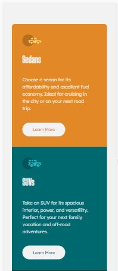
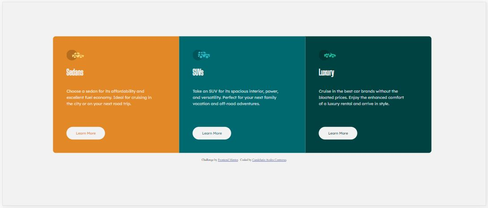

# Frontend Mentor - 3-column preview card component solution

This is a solution to the [3-column preview card component challenge on Frontend Mentor](https://www.frontendmentor.io/challenges/3column-preview-card-component-pH92eAR2-). Frontend Mentor challenges help you improve your coding skills by building realistic projects. 

## Table of contents

- [Overview](#overview)
  - [The challenge](#the-challenge)
  - [Screenshots](#screenshots)
  - [Links](#links)
- [My process](#my-process)
  - [Built with](#built-with)
  - [What I learned](#what-i-learned)
  - [Continued development](#continued-development)
  - [Useful resources](#useful-resources)
- [Author](#author)

## Overview

### The challenge

Users should be able to:

- View the optimal layout depending on their device's screen size
- See hover states for interactive elements

### Screenshots

### Links

- Solution URL: [GitHub Project](https://github.com/candelarioavalos/FEMentor02)
- Live Site URL: [GitHub Pages](https://candelarioavalos.github.io/FEMentor02)

## My process

### Built with

- Semantic HTML5 markup
- CSS custom properties
- Flexbox
- Mobile-first workflow
- [Google fonts](https://fonts.google.com/)

### What I learned

When I was trying to link the proper google fonts, I thought that the links at the style-guide for such purpose would work, but in my case, they didn't, so I went to w3schools to get the proper line of code in order to set that for each font.

Like in the previous task, I worked on three different css files, one css for general styles, one for mobile version and one more for desktop version, and it worked just great. I like this way of coding.
Also, I decided to set the break point for views to 1350 pixels, so, phone version for max-width: 1349px and desktop version for min-width: 1350px.

While coding the general css stiles file, I decided to create and use variable names for colors, that way I could easily choose the corresponding colors for fonts, backgrounds, etc.

For margins and paddings, I had to resize the view of the design images to decide how many pixels I was going to set for each of this elements and how to set them in order to set the apropriate spaces acording to the design images.

### Continued development

I'm excited to keep learning and practicing styles.

### Useful resources

- [w3schools.com](https://www.w3schools.com/) - This is the page where I have learned the most, they have a lot of easy to learn tutorials for web development and a lot of examples for every topic and language. I will keep studying at w3schools for a while, it is so exciting! Every time I need to see a code example, I search here first!

- [stackoverflow.com](https://stackoverflow.com/) - This is definitely a must while coding, I google everything I have a question abut all the time, and stackoverflow is always one of the options with the possible answer.

## Author

- GitHub - [Candelario Avalos Contreras](https://github.com/candelarioavalos)
- Frontend Mentor - [Candelario Avalos Contreras](https://www.frontendmentor.io/profile/candelarioavalos)
- Facebook - [Candelario Avalos Contreras](https://www.facebook.com/candelario.avaloscontreras/)
- LinkedIn - [Candelario Avalos Contreras](https://www.linkedin.com/in/candelario-avalos-4a575b1b9/)